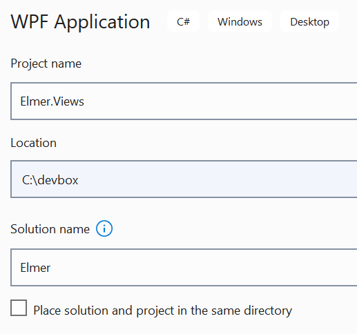
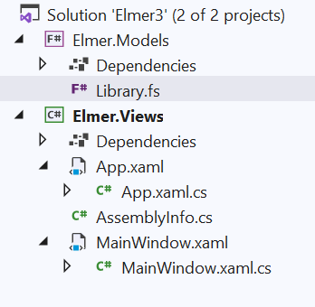
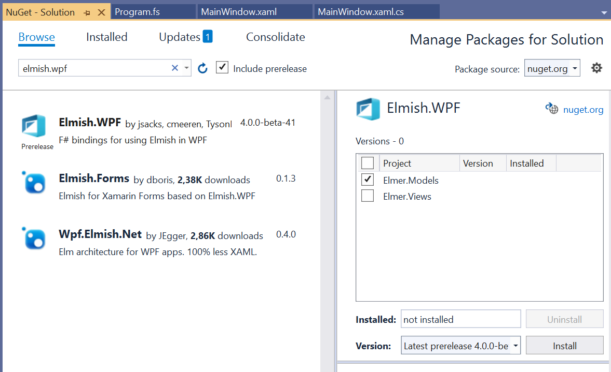
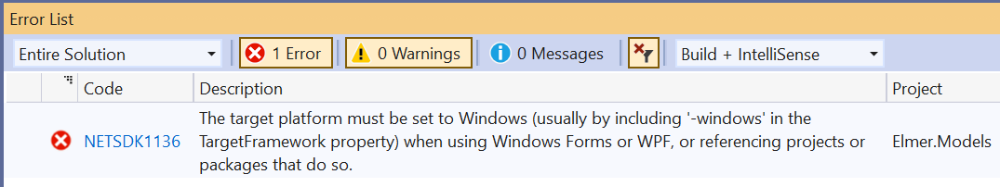
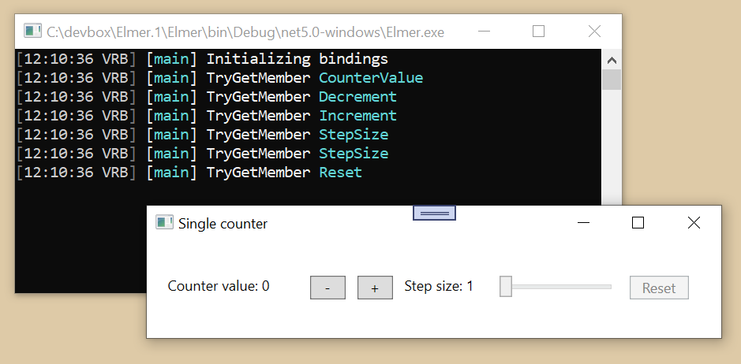

# How to create an Elmish.WPF application - part 1

I admit this article goes about explaining things in a meticulous way, so much so that somewhat more experienced developers can get slightly frustrated. I want total newcomers to F# and .NET to be able to follow along from the very start, and have a really smooth ride for the first few lessons. We'll pick up speed soon enough.

For this demonstration, Visual Studio 2019 version 16.10.3 and Elmish.WPF version 4.0.0-beta-41 is used.

For this demo the name Elmer is used throughout. The application project will be named Elmer.Views, the library with the business logic Elmer.Models, and the solution just Elmer.

In Visual Studio, create a new C# WPF application. (In the menu, do File/New/Project... to open a dialog, and find and select the project type named WPF Application.)



The target framework will be .NET 5.0 for this demo.

Add a second project to the solution. (In the menu, do File/Add/New Project..., and this time find the project type named Class library, but make sure it's the one for F#.) Save this F# class library as Elmer.Models. Use the same target framework again.

The Solution Explorer should now show this content.



Rename Library.fs to Program.fs (Just click on the file name to edit it.)

Make Elmer.Views depend on Elmer.Models. (Right click on Dependencies below Elmer.Views, select Add Project Reference..., now check Elmer.Models, and do OK.)

Now it's time to add the libraries we need from NuGet. (Right click on Solution Elmer, and select Manage NuGet Packages for Solution... to open the package manager.)

From NuGet, add Elmish.WPF prerelease 4.0.0-beta-41 to Elmish.Models. (Click on Browse, check Include prerelease, and type "elmish.wpf" in the filter box. Select the Elmish.WPF package on the top by clicking on it, check Elmer.Models on the right, and click Install. This has the effect of downloading the package to the machine, and adding a reference to it in the Elmer.Models project file.)



You will now likely see an error message in the Error List.



To fix this error, click on Elmer.Models, so that the file Elmer.Models.fsproj is opened. Change the TargetFramework so that it looks like this. The text "-windows" has been appended to the text "net5.0". The error will probably vanish as soon as the file is saved. In any case, it's fixed.

```
<TargetFramework>net5.0-windows</TargetFramework>
```

Three more libraries are needed. (Uncheck Include prerelease, because we don't want prereleases of these libraries. This time type "serilog" in the filter box. For each of the tree packages, select the package, and click Install. Also now only Elmer.Models should be checked while this is done.) From NuGet, add

* Serilog
* Serilog.Extensions.Logging
* Serilog.Sinks.Console

Now more source files must be edited.

In the Elmer.Views project, edit like this. The OutputType is changed, and the line with DisableWinExeOutputInference is added. This change will cause the console window to appear in addition to MainWindow, and the logging will go to the console window. The library Serilog.Sinks.Console is responsible for channeling the logs to the console window.

```
  <PropertyGroup>
    <OutputType>Exe</OutputType>
    <DisableWinExeOutputInference>true</DisableWinExeOutputInference>
```

In the Elmer.Models project, remove these lines

    <GenerateDocumentationFile>true</GenerateDocumentationFile>
    <WarnOn>3390;$(WarnOn)</WarnOn>

and add these lines instead.

    <TreatWarningsAsErrors>true</TreatWarningsAsErrors>
    <WarningLevel>4</WarningLevel>

The entire file should now look like this.

###### Elmer.Models.fsproj

```
<Project Sdk="Microsoft.NET.Sdk">

  <PropertyGroup>
    <TargetFramework>net5.0-windows</TargetFramework>
    <TreatWarningsAsErrors>true</TreatWarningsAsErrors>
    <WarningLevel>4</WarningLevel>
  </PropertyGroup>

  <ItemGroup>
    <Compile Include="Program.fs" />
  </ItemGroup>

  <ItemGroup>
    <PackageReference Include="Elmish.WPF" Version="4.0.0-beta-41" />
    <PackageReference Include="Serilog" Version="2.10.0" />
    <PackageReference Include="Serilog.Extensions.Logging" Version="3.0.1" />
    <PackageReference Include="Serilog.Sinks.Console" Version="3.1.1" />
  </ItemGroup>

</Project>
```

This program needs something to do. The demonstration functionality from SingleCounter demo in the Elmish.WPF repo will be used.

There are three more files that need to be edited, and then we're done. You can simply copy and paste the source shown into the files if you want to forge ahead, or you can edit piece by piece to understand the changes that are done. The original contents of Program.fs is hardly of interest, but the before and after states of the other two files are perhaps slightly more interesting.

There is a very high risk that you will experience some odd problems with Visual Studio's WPF XAML designer when making the change to MainWindow.xaml. There may be some errors that just won't go away. If you experience this, then simply restart Visual Studio.

###### Program.fs

```
module Elmer.Core.Program

open Serilog
open Serilog.Extensions.Logging
open Elmish.WPF

type Model =
    {
        Count: int
        StepSize: int
    }

type Msg =
    | Increment
    | Decrement
    | SetStepSize of int
    | Reset

let init =
    {
        Count = 0
        StepSize = 1
    }

let canReset = (<>) init

let update msg m =
    match msg with
    | Increment -> { m with Count = m.Count + m.StepSize }
    | Decrement -> { m with Count = m.Count - m.StepSize }
    | SetStepSize x -> { m with StepSize = x }
    | Reset -> init

let bindings () : Binding<Model, Msg> list = [
    "CounterValue" |> Binding.oneWay (fun m -> m.Count)
    "Increment" |> Binding.cmd Increment
    "Decrement" |> Binding.cmd Decrement
    "StepSize" |> Binding.twoWay((fun m -> float m.StepSize), int >> SetStepSize)
    "Reset" |> Binding.cmdIf(Reset, canReset)
    ]

let designVm = ViewModel.designInstance init (bindings ())

let main window =

    let logger =
        LoggerConfiguration()
            .MinimumLevel.Override("Elmish.WPF.Update", Events.LogEventLevel.Verbose)
            .MinimumLevel.Override("Elmish.WPF.Bindings", Events.LogEventLevel.Verbose)
            .MinimumLevel.Override("Elmish.WPF.Performance", Events.LogEventLevel.Verbose)
            .WriteTo.Console()
            .CreateLogger()
    
    WpfProgram.mkSimple (fun () -> init) update bindings
    |> WpfProgram.withLogger (new SerilogLoggerFactory(logger))
    |> WpfProgram.startElmishLoop window
```

###### App.xaml.cs

```
using System;
using System.Windows;

namespace Elmer
{
    public partial class App : Application
    {
        public App()
        {
            this.Activated += StartElmish;
        }

        private void StartElmish(object sender, EventArgs e)
        {
            this.Activated -= StartElmish;
            Elmer.Core.Program.main(MainWindow);
        }
    }
}
```

###### MainWindow.xaml

```
<Window x:Class="Elmer.MainWindow"
        xmlns="http://schemas.microsoft.com/winfx/2006/xaml/presentation"
        xmlns:x="http://schemas.microsoft.com/winfx/2006/xaml"
        xmlns:d="http://schemas.microsoft.com/expression/blend/2008"
        xmlns:mc="http://schemas.openxmlformats.org/markup-compatibility/2006"
        xmlns:local="clr-namespace:Elmer"
        xmlns:vm="clr-namespace:Elmer.Core;assembly=Elmer.Core"
        mc:Ignorable="d"
        Title="Single counter"
        Height="120"
        Width="500"
        WindowStartupLocation="CenterScreen"
        d:DataContext="{x:Static vm:Program.designVm}">
    <StackPanel Orientation="Horizontal" HorizontalAlignment="Center" VerticalAlignment="Top" Margin="0,25,0,0">
        <TextBlock Text="{Binding CounterValue, StringFormat='Counter value: {0}'}" Width="110" Margin="0,5,10,5" />
        <Button Command="{Binding Decrement}" Content="-" Margin="0,5,10,5" Width="30" />
        <Button Command="{Binding Increment}" Content="+" Margin="0,5,10,5" Width="30" />
        <TextBlock Text="{Binding StepSize, StringFormat='Step size: {0}'}" Width="70" Margin="0,5,10,5" />
        <Slider Value="{Binding StepSize}" TickFrequency="1" Maximum="10" Minimum="1" IsSnapToTickEnabled="True" Width="100" Margin="0,5,10,5" />
        <Button Command="{Binding Reset}" Content="Reset" Margin="0,5,10,5" Width="50" />
    </StackPanel>
</Window>
```

The application is ready to run in Visual Studio. It will look something like this.



